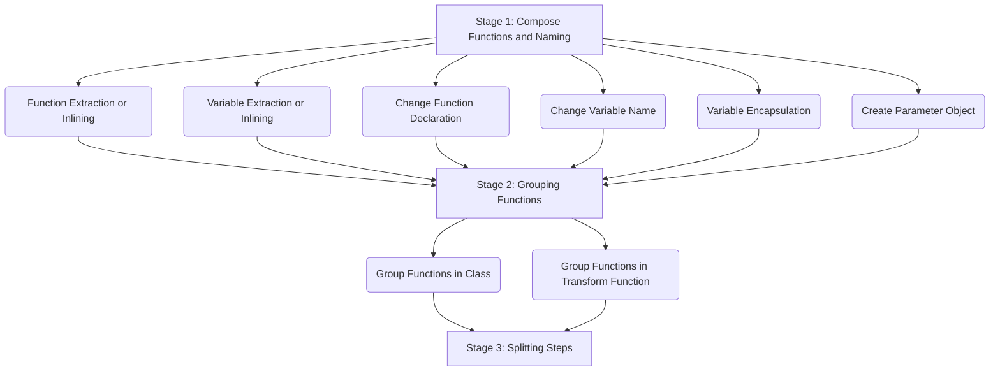

> IN THE MIDDLE OF PROGRESS
- This summary provides a concise overview of the key concepts and principles presented in the book, focusing on the art of refactoring code to improve its design and maintainability. 
- With the inclusion of qualified code examples, you'll gain a deeper understanding of how to improve the readability and maintainability of your codebase. 
- The structure of this summary draws inspiration from [Hugo Matilla's work.](https://github.com/HugoMatilla/Refactoring-Summary)

# TABLE OF CONTENT
- [I. Bad Smells in Code](#i-bad-smells-in-code)
	- [1. Mysterious Name](#1-mysterious-name)
	- [2. Duplicated code](#2-duplicated-code)
	- [3. Long Function](#3-long-function)
	- [4. Long Parameter List](#4-long-parameter-list)
	- [5. Global Data](#5-global-data)
	- [6. Mutable Data](#6-mutable-data)
	- [7. Divergent Change](#7-divergent-change)
	- [8. Shotgun Surgery](#8-shotgun-surgery)
	- [9. Feature Envy](#9-feature-envy)
	- [10. Data Clumps](#10-data-clumps)
	- [11. Primitive Obsession](#11-primitive-obsession)
	- [12. Repeated Switches](#12-repeated-switches)
	- [13. Loops](#13-loops)
	- [14. Lazy Element](#14-lazy-element)
	- [15. Speculative Generality](#15-speculative-generality)
	- [16. Temporary Field](#16-temporary-field)
	- [17. Message Chain](#17-message-chain)
	- [18. Middle Man](#18-middle-man)
	- [19. Insider Trading](#19-insider-trading) 
	- [20. Large Classes](#20-large-classes)
	- [21. Alternative Classes with Different Interfaces](#21-alternative-classes-with-different-interfaces)
	- [22. Data Class](#22-data-class)
	- [23. Refused Bequest](#23-refused-bequest)
	- [24. Comments](#24-comments)
- [II. A First Set of Refactorings](#ii-a-first-set-of-refactorings)
	- [1. II Overview](#1-ii-overview)
 	- [2. Function Extraction or Inlining](#2-function-extraction-or-inlining)
	- [3. Variable Extraction or Inlining](#3-variable-extraction-or-inlining)
	- [4. Changing Function Declaration](#4-changing-function-declaration)
- [III. Encapsulation](#iii-encapsulation)
- [IV. Moving Features](#iv-moving-features)
- [V. Organizing Data](#v-organizing-data)
- [VI. Simplifying Conditional Logic](#vi-simplifying-conditional-logic)
- [VII. Refactoring APIs](#vii-refactoring-apis)
- [VIII. Dealing with Inheritance](#viii-dealing-with-inheritance)
 
# I. Bad Smells in Code
### 1. Mysterious Name
Code names lack both simplicity and clarity
### 2. Duplicated code
The same code snippet exists in multiple places.
```kotlin
fun calculateSalesTax(amount: Double): Double {
    return amount * 0.08
}

fun calculateServiceTax(amount: Double): Double {
    return amount * 0.08
}
```
### 3. Long Function
There is overly long logic in a single function.
```kotlin
fun calculateTotal(cart: List<Product>): Double{
    var total = 0.0

    // caculate sub total
    for (product in cart) {
        total += product.price
    }

    // apply discount 
    if (total > 100) {
        total -= total * 0.1
    }

    // add sales tax
    val tax = total * 0.08
    total += tax

    return total
}
```
### 4. Long Parameter List
There are too many parameters in the function signature.
### 5. Global Data
There is global data accessible throughout the codebase.
### 6. Mutable Data
There is mutable data with potential side effects due to changes.
### 7. Divergent Change
One object is frequently modified due to multiple concerns.
```kotlin
data class Address(var street: String, var city: String, var state: String, var zip: String)

data class Order(var id: Int, var product: String, var quantity: Int)

class UserProfile {
    var username: String = ""
    var email: String = ""
    var address: Address = Address("", "", "", "")
    var orders: MutableList<Order> = mutableListOf()

    // user profile management
    fun changeUsername(newUsername: String) {
        username = newUsername
    }

    // address management
    fun changeAddress(newAddress: Address) {
        address = newAddress
    }

    // order management
    fun placeOrder(newOrder: Order) {
        orders.add(newOrder)
    }
}
```
### 8. Shotgun Surgery
The same code snippet is scattered across multiple concerns.
```kotlin
class OrderConfirmation {
    fun sendConfirmationEmail(order: Order) {
        // Send order confirmation email
    }
}

class OrderHistory {
    fun sendConfirmationEmail(order: Order) {
        // Send order confirmation email
    }
}

class OrderStatus {
    fun sendConfirmationEmail(order: Order) {
        // Send order confirmation email
    }
}
```
### 9. Feature Envy
Some attributes of an object are frequently used by other objects.
```kotlin
class Customer(
    val name: String,
    val age: Int,
    val address: Address
)

class Order(
    val customer: Customer,
    val items: List<Item>
) {
    fun calculateTotal(): Double { /*...*/ }

    fun printCustomerDetails() {
        println("Customer Name: ${customer.name}")
        println("Customer Age: ${customer.age}")
        println("Customer Address: ${customer.address}")
    }
}
```
### 10. Data Clumps
There are combinations of data that are used together in most cases.
```kotlin
class Order(
    private val orderNumber: String,
    private val customerName: String,
    private val customerEmail: String,
    private val customerAddress: Address,
    private val items: List<Item>
)

class Address(
    val street: String,
    val city: String,
    val state: String,
    val zipCode: String
)

class Item(
    val name: String,
    val price: Double
)
```
### 11. Primitive Obsession
Primitive types are used instead of defining objects that meet the requirements.
```kotlin
data class User(
    val name: String, 
    val email: String, 
    val phoneNumber: String
)
```
### 12. Repeated Switches
When adding a new case, associated cases need to be added everywhere switch statements exist.
```kotlin
enum class AnimalType {
    DOG, CAT, BIRD
}

class Animal(val type: AnimalType) {
    fun makeSound() {
        when (type) {
            AnimalType.DOG -> println("Woof!")
            AnimalType.CAT -> println("Meow!")
            AnimalType.BIRD -> println("Tweet!")
        }
    }

    fun eat() {
        when (type) {
            AnimalType.DOG -> println("Dog is eating...")
            AnimalType.CAT -> println("Cat is eating...")
            AnimalType.BIRD -> println("Bird is eating...")
        }
    }
}
```
### 13. Loops
There are loops that are difficult to understand the intention of the code.
```kotlin
fun sumOfPositiveNumbers(numbers: List<Int>): Int {
    var total = 0
    for (number in numbers) {
        if (number > 0) {
            total += number
        }
    }
    return total
}
```
### 14. Lazy Element
There are objects defined with weak functionality.
```kotlin
class UserName(val name: String)

fun printUserName(userName: UserName) {
    println(userName.name)
}

val user = UserName("John Doe")
printUserName(user) // Outputs: John Doe
```
### 15. Speculative Generality
There are cases where implementations are done in advance based on assumptions.
```kotlin
interface PaymentMethod {
    fun processPayment(amount: Double)
}

class CreditCardPayment : PaymentMethod {
    override fun processPayment(amount: Double) {
        // process credit card payment
    }
}

class BitcoinPayment : PaymentMethod {
    override fun processPayment(amount: Double) {
        // process bit coin payment
    }
}
```
### 16. Temporary Field
There are variables that are only used in specific situations.
```kotlin
class Shopping {
    var eventDiscount: Double? = null

    fun getTotalPrice(items: List<Item>): Double {
        var total = items.sumOf { it.price }

        if (eventDiscount != null) {
            total -= total * eventDiscount!!
        }

        return total
    }
}
```
### 17. Message Chain
There is a structure where a client requests one object, which then requests another object.
```kotlin
class Order(val customer: Customer)
class Customer(val address: Address)
class Address(val city: City)
class City(val name: String)

// Client code
val order = Order(Customer(Address(City("New York"))))
val cityName = order.customer.address.city.name
```
### 18. Middle Man
An object is unable to fulfill its own responsibilities, and delegates responsibility to another object.
```kotlin
class Order(val totalCost: Double)

class PaymentProcessor {
    fun processPayment(order: Order, paymentMethod: PaymentMethod) {
        paymentMethod.pay(order.totalCost)
    }
}

interface PaymentMethod {
    fun pay(amount: Double)
}

class CreditCard : PaymentMethod {
    override fun pay(amount: Double) {
        // payment logic
    }
}

// Client code
val order = Order(100.0)
val paymentMethod = CreditCard()
PaymentProcessor.processPayment(order, paymentMethod)
```
### 19. Insider Trading
An object is excessively coupled with the internals of another object.
```kotlin
class Trader(private val stockMarket: StockMarket) {

    fun buy(stock: Stock, quantity: Int): Double {
	// needs to know about the inner workings of StockMarket to make a trade.
        if (!stockMarket.stocks.contains(stock)) {
            throw RuntimeException("Stock not available in the market.")
        }
        val cost = stock.price * quantity
        stock.price += quantity // directly manipulates the price of Stock
        return cost
    }
}

class Stock(var price: Double) 

class StockMarket {
    var stocks: MutableList<Stock> = mutableListOf()

    fun addStock(stock: Stock) {
        stocks.add(stock)
    }
}
```
### 20. Large Classes
An Class has too many responsibilities.
```kotlin
class Trader(var name: String, var address: String, var phoneNumber: String, var accountBalance: Double) {
    //...
    fun buy(stock: Stock, quantity: Int) {
        // buy logic
    }

    fun sell(stock: Stock, quantity: Int) {
        // sell logic
    }

    fun updateAddress(newAddress: String) {
        this.address = newAddress
    }

    fun updatePhoneNumber(newPhoneNumber: String) {
        this.phoneNumber = newPhoneNumber
    }

    fun deposit(amount: Double) {
        this.accountBalance += amount
    }

    fun withdraw(amount: Double) {
        if (this.accountBalance < amount) {
            throw IllegalArgumentException("Insufficient balance!")
        }
        this.accountBalance -= amount
    }
    //...
}
```
### 21. Alternative Classes with Different Interfaces
Classes perform similar functions on a large scale, but have different interfaces.
```kotlin
class StockTrader {
    fun purchaseStock(stock: Stock, quantity: Int) {
        // buy logic
    }

    fun sellStock(stock: Stock, quantity: Int) {
        // sell logic
    }
}

class CryptoTrader {
    fun acquireCrypto(crypto: Crypto, quantity: Int) {
        // buy logic
    }

    fun disposeCrypto(crypto: Crypto, quantity: Int) {
        // sell logic
    }
}
```
### 22. Data Class
Attributes are manipulated in data class.
```kotlin
// Data Class
data class Image(var width: Int, var height: Int, val format: String) {
    fun resize() {
        // resize width and height
    }
}
```
### 23. Refused Bequest
A child object does not use some of the methods of its parent object.
```kotlin
open class Vehicle {
    open fun startEngine() {
        // start engine
    }

    open fun move() {
        // move
    }

    open fun stop() {
        // stop
    }
}

class Car: Vehicle() {
    override fun startEngine() {
        // start car engine
    }

    override fun move() {
        // car moves
    }

    override fun stop() {
        // car stops
    }
}

class Bicycle: Vehicle() {
    override fun startEngine() {
        throw UnsupportedOperationException("Bicycles don't have engines")
    }

    override fun move() {
        // bicycle moves
    }

    override fun stop() {
        // bicycle stops
    }
}
```
### 24. Comments
Comments are added because the code itself cannot sufficiently explain the business logic.
```kotlin
class OrderProcessing {

    fun processOrder(order: Order) {
        // validate order
        if (order.items.isEmpty()) {
            throw IllegalArgumentException("Order cannot be empty")
        }
        if (order.customer == null) {
            throw IllegalArgumentException("Customer information is required")
        }

        // calculate total
        var total = 0.0
        for (item in order.items) {
            total += item.price
        }

        // apply discount
        if (order.customer.isPremium) {
            total *= 0.9  // 10% discount for premium customers
        }

        // create invoice
        val invoice = Invoice(order.customer, total)

        // send invoice
        sendInvoice(invoice)
    }

    private fun sendInvoice(invoice: Invoice) {
        // send the invoice
    }
}
```
# II. A First Set of Refactorings
### 1. II Overview


### 2. Function Extraction or Inlining 
> Extract based on the separation of 'purpose' and 'implementation'

If the code contains the implementation, it is extracted into a function. Conversely, if the extracted function contains the purpose, it is inlined. 

It is not important if the function name is longer than the function body or if the function body is too short.
- Function Extraction Example
    
    ```kotlin
    class OrderService() {
    	fun placeOrder(order: Order)
    	   val totalPrice = order.items.sumOf { item -> item.price }
    	   var finalPrice = if (order.items.size >= 10) totalPrice * 0.9 else totalPrice
    	   order.status = Status.COMPLETED
    	   order.totalPrice = finalPrice
        }
    }
    ```
    
    to
    
    ```kotlin
    class OrderService() {
    	fun placeOrder(order: Order) {
    	   val totalPrice = order.items.sumOf { item -> item.price }
    	   val finalPrice = applyDiscounts(totalPrice)
    	   finalizeOrder(finalPrice)
    	}

    	private fun applyDiscounts(totalPrice: Double): Double {
    	   return if (order.items.size >= 10) totalPrice * 0.9 else totalPrice
        }

    	private fun finalizeOrder(finalPrice: Double) {
    	   order.status = Status.COMPLETED
    	   order.totalPrice = finalPrice
        }
    }
    ```
    
- Function Inlining Example
    
    ```kotlin
    class OrderService() {
    	fun placeOrder(order: Order) {
    	   val totalPrice = calculateTotal()
    	   val finalPrice = applyDiscounts(totalPrice)
    	   finalizeOrder(finalPrice)
        }
    	// ...omitted
    }
    ```
    
    to
    
    ```kotlin
    class OrderService() {
    	fun placeOrder(order: Order) {
    	   val totalPrice = order.items.sumOf { item -> item.price }
    	   val finalPrice = applyDiscounts(totalPrice)
    	   finalizeOrder(finalPrice)
        }
    	// ...omitted
    }
    ```


### 3. Variable Extraction or Inlining 
> Again extracted based on the separation of 'purpose' and 'implementation'

If the code to be extracted has meaning outside of the function, it should be extracted into a function rather than a variable.

- Variable Extraction Example
    
    ```kotlin
    private fun applyDiscounts(totalPrice: Double): Double {
    	return if (order.items.size >= 10) totalPrice * 0.9 else totalPrice
    }
    ```
    
    to
    
    ```kotlin
    private fun applyDiscounts(totalPrice: Double): Double {
    	val isDiscountApplicable = order.items.size >= 10
    	val discountRate = 0.9
    	return if (isDiscountApplicable) totalPrice * discountRate else totalPrice
    }
    ```
    
- Variable Inlining Example
    
    ```kotlin
    private fun applyDiscounts(totalPrice: Double): Double {
    	val itemSize = order.items.size
    	val discountRate = 0.9
    	return if (itemSize >= 10) totalPrice * discountRate else totalPrice
    }
    ```
    
    to
    
    ```kotlin
    private fun applyDiscounts(totalPrice: Double): Double {
    	val discountRate = 0.9
    	return if (order.items.size >= 10) totalPrice * discountRate else totalPrice
    }
    ```
### 4. Changing Function Declaration
> Declare the name and parameters of the function in line with its 'purpose'

When it comes to the name, it should be defined according to the purpose it serves where it's called, not based on its internal implementation.

As for parameters, you should decide whether to deliver only essential values to increase utilization, or to pass associated objects to raise the level of encapsulation.
- Example of Changing Function Name
	```kotlin
	class Bank() {
	    fun calculateInterestByAccountType(account: Account): Double {
		val rate = if (account.type == AccountType.CHECKING) 0.01 else 0.02
		return account.balance * rate
	    }
	}
	```
	
	to
	
	```kotlin
	class Bank() {
	    fun calculateInterest(account: Account): Double {
		val rate = if (account.type == AccountType.CHECKING) 0.01 else 0.02
		return account.balance * rate
	    }
	}
	
	```
- Example of Changing Parameters
	```kotlin
	fun applyDiscount(totalPrice: Double, numberOfItems: Int): Double {
	    val discountRate = 0.9
	    return if (numberOfItems >= 10) totalPrice * discountRate else totalPrice
	}

	```
	
	to
	
	```kotlin
	fun applyDiscount(order: Order): Double {
	    val discountRate = 0.9
	    return if (order.items.size >= 10) order.totalPrice * discountRate else order.totalPrice
	}

	
	```

# III. Encapsulation

# IV. Moving Features

# V. Organizing Data

# VI. Simplifying Conditional Logic

# VII. Refactoring APIs

# VIII. Dealing with Inheritance

